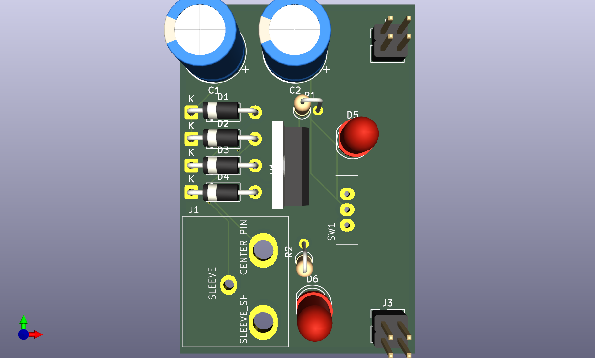
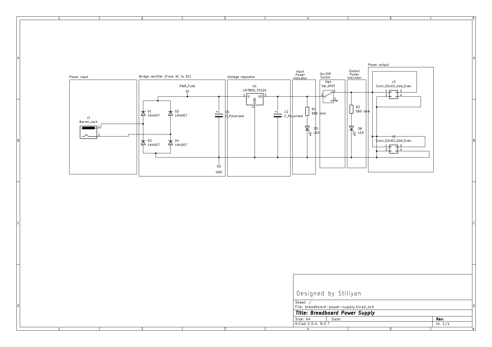

# Breadboard 5V Power Supply (LM7805)

- Converts an input DC voltage (recommended 7–12V) into a stable 5V output using an LM7805 voltage regulator. This can be used to power 5V devices such as sensors and small embedded circuits.
- Connections: Connect a DC power adapter to the barrel jack input, and obtain regulated 5V and GND from the output pin headers.
- This project was created to learn KiCad and basic power supply design. It represents my early steps into hardware development and PCB layout. (inspiration from Ikarthikmb)

  
---

| 3D View |
|---------|
|  |

| Schematic Diagram |
|---------|
|  |
